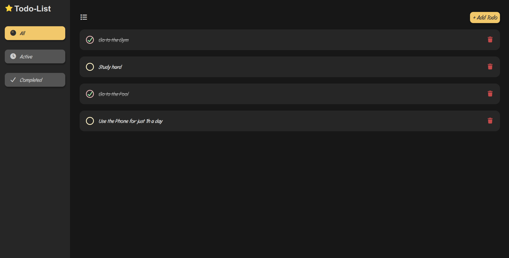
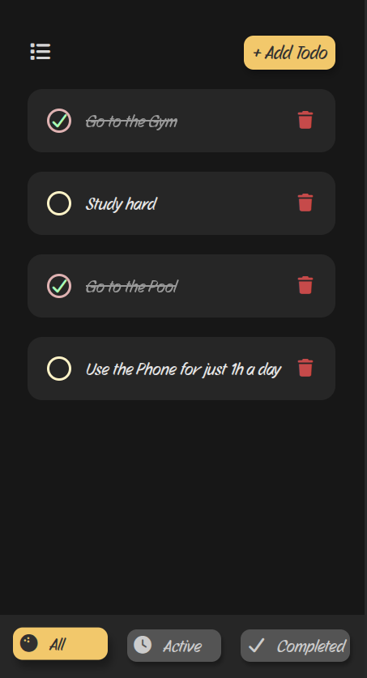

# 📝 Todo List App

A simple and elegant **Todo List** web app built with **HTML, CSS, and JavaScript**.  
It allows users to add, delete, and mark tasks as complete. Tasks are **saved in LocalStorage**, so they stay even after refreshing the page.

---

## 🚀 Features

✅ Add new tasks easily  
✅ Mark tasks as completed  
✅ Delete tasks with one click  
✅ Filter tasks (All, Active, Completed)  
✅ Smooth animations for adding/removing tasks  
✅ Fully responsive design  
✅ Data persists using LocalStorage  

---

## 🚀 Live Demo

🔗 [**Click here to try the Todo List App**](https://wadoud-me.github.io/Todo-List/) 

---

## 🖼️ Screenshots

| Desktop View | Mobile View |
|-------------|------------|
|  |  |

---

## 🛠️ Tech Stack

- **HTML5**
- **CSS3** (Flexbox, Responsive Design)
- **JavaScript (ES6)**

---


## 💻 Getting Started

1. Clone the repository:
   ```bash
   git clone https://github.com/Wadoud-ME/Todo-List.git
   ```

2. Navigate to the project folder
    ```bash
    cd todo-list-app
    ```

3. Open `index.html` in your browser
    ```bash
      open index.html
    ```